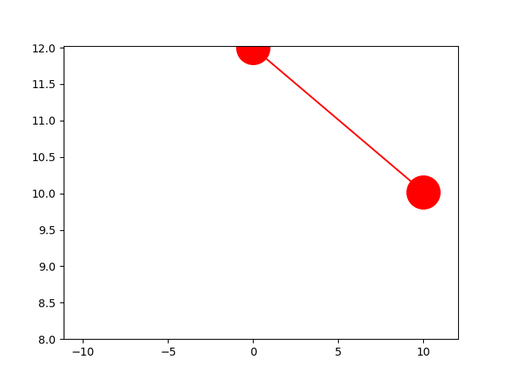

# 単振り子の運動アニメーション
空気抵抗を考慮した単振り子の運動をアニメーションで可視化しました。
数値計算はC++、可視化はPython3で行いました。

## main.cpp 
単振り子の空気抵抗を考慮した運動を計算するプログラムです。
解析した単振り子のx, yは「result.txt」に出力されます。

## plot.py
C++のプログラムが出力した「result.txt」を元にアニメーションを作成するPython スクリプトです。
「pandas」、「matplotlib」が必要です。また、アニメーション作成のために「imagemagick」が必要です。
実行すると「pendulum.gif」が出力されます。

 

# make
C++ のプログラム、Python3 のスクリプトファイルをコンパイルから実行を行います。